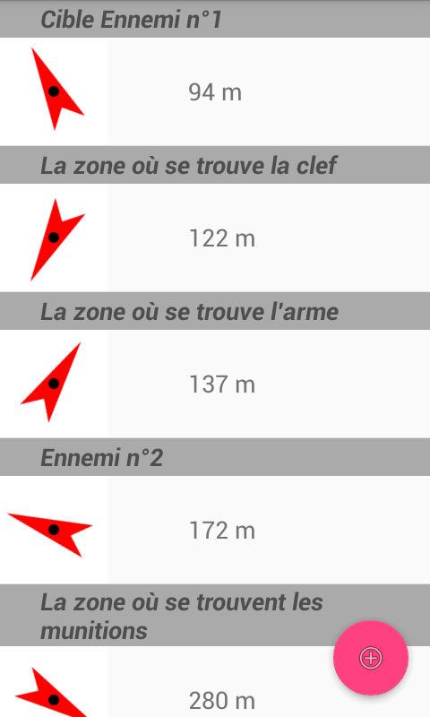
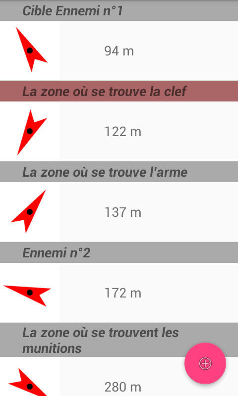
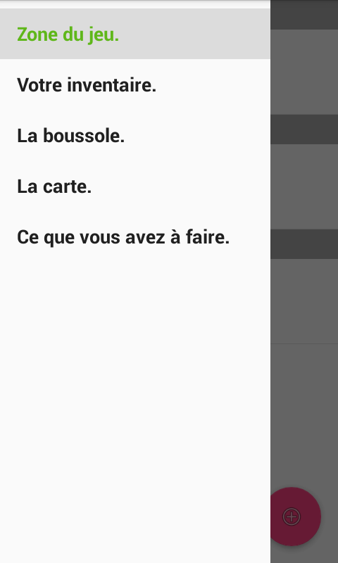
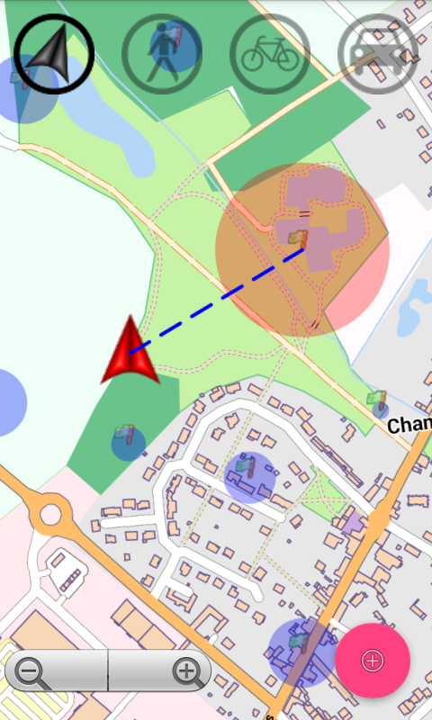
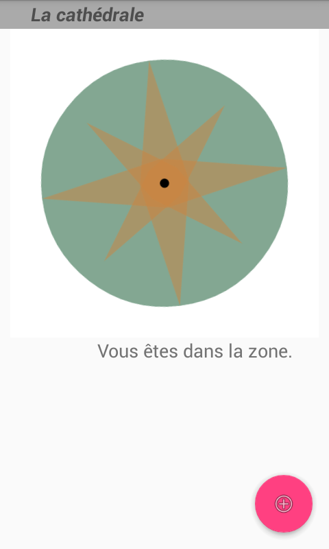

# GpsFictionProjects

This will be designed as a CMS.

Goal: Create a basic software (usable as a library) that allows you to create games fun tracks and interactive tours.

### Before to use:
1) Create some directories named /sdesimeur/mapsforge/ in Internal Card of the android's device.

2) Download an OSM map with .map extension (for example: http://download.mapsforge.org/maps/europe/france/picardie.map)

3) Copy this map as 'Internal Card'/sdesimeur/mapsforge/jeu.map

4) Create some directories named /sdesimeur/graphhopper/ in Internal Card of the android's device.

5) Download the same OSM map as previous with .pbf extension (for example: http://download.geofabrik.de/europe/france/picardie-latest.osm.pbf)

6) Copy this map as 'Internal Card'/sdesimeur/graphhopper/jeu.pbf

### Screenshots

